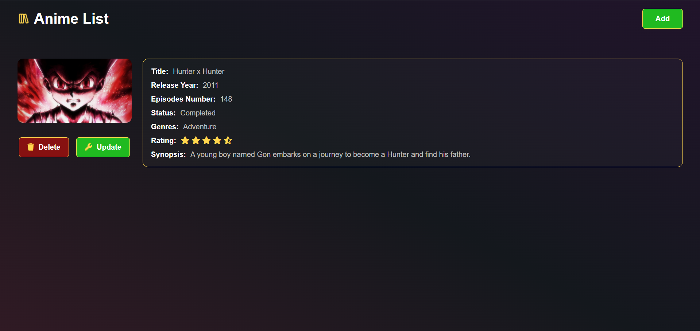
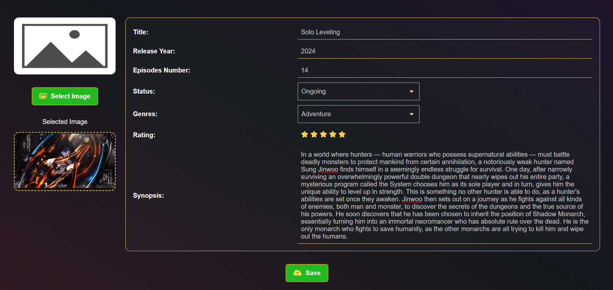

# Anime List App

Anime List App is a web application that allows users to manage anime cards. Users can create, update, delete, and upload cover images for anime cards. The app also supports pagination to manage large lists of anime cards efficiently.

## Project Structure

- `anime-list-ui/`: Frontend code using React and Vite
- `anime-list-backend/`: Backend code using Spring Boot

## Live Demo

The live application can be accessed at [Anime Cards](https://anime-cards.netlify.app/).

## Features

- Create, update, delete anime cards
- Upload or update cover images for anime cards
- Pagination for managing large lists

## Getting Started

### Prerequisites

- Node.js and npm (for the frontend)
- Java and Maven (for the backend)
- PostgreSQL (for the database)

### Setup

For detailed setup instructions, refer to the `README.md` files in the `anime-list-ui` and `anime-list-backend` directories.

### Frontend

Navigate to the [frontend `README.md`](anime-list-ui/README.md) for setup instructions.

### Backend

Navigate to the [backend `README.md`](anime-list-backend/README.md) for setup instructions.

## Deployment

### Frontend

The frontend is deployed on Netlify. Detailed deployment instructions are available in the `anime-list-ui` directory.

### Backend

The backend is deployed on Railway. Detailed deployment instructions are available in the `anime-list-backend` directory.

## Contributing

Contributions are welcome! Please fork the repository and submit a pull request with your changes.

## License

This project is licensed under the MIT License - see the [LICENSE](LICENSE) file for details.
