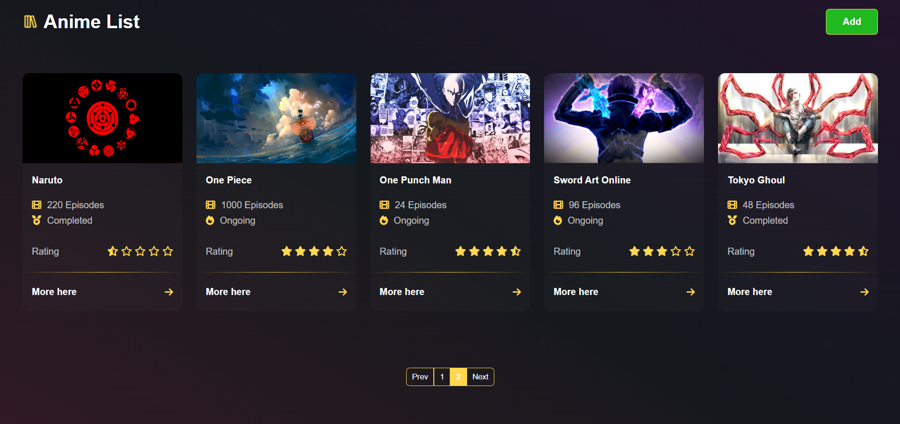

# Anime List UI

Welcome to Anime List UI, the frontend component of our full-stack application built with React and JavaScript, utilizing VITE.

## Features

- **Pagination**: Easily navigate through your anime list with our pagination feature.

- **Custom Image Uploader**: Upload custom images to personalize your anime entries.

- **Custom Selection List**: Tailor your anime selections with our customizable list feature.

## Getting Started

1. Clone this repository.
2. Navigate to the `anime-list-ui` directory.
3. Run `npm install` to install dependencies.
4. Set the environment variable `VITE_API_URL` to your backend URL.
5. Run `npm run dev` to start the development server.

## Environment Variable

To connect to the backend, set the following environment variable:

- **VITE_API_URL**: Base URL of the backend

## Screenshots

## License

This project is licensed under the terms of the MIT license. See the [LICENSE](../LICENSE) file for details.
